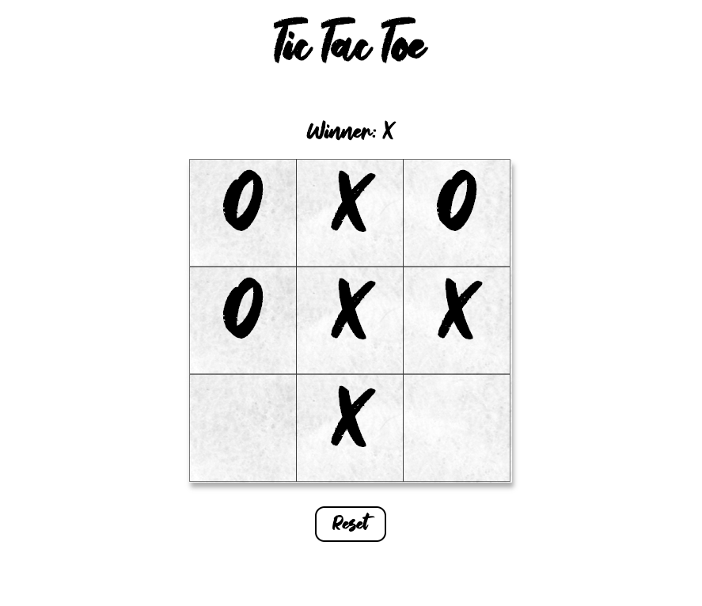

This project was bootstrapped with [Create React App](https://github.com/facebook/create-react-app).

Tic-tac-toe, also known as noughts and crosses, or Xs and Os is a game for two players, X and O, who take turns marking the spaces in a 3×3 grid. The player who succeeds in placing three of their marks in a horizontal, vertical, or diagonal row is the winner.

[Play the game](http://tic-tac-toe-sk.surge.sh/)

[Tutorial](https://reactjs.org/docs/create-a-new-react-app.html)

## Tic Tac Toe

